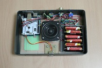

PicoPico BOX
=========

This is a Project of "PicoPico BOX", that is a Musical Instrument with 8-bit sound.
Some boards, a speaker and some parts on the market are combined into the gadget.
By using X-BOX One controller can be played music.
"Pico Pico" is a Japanese Onomatopoeia to express 8-bit sound.
There is a smaller version. It is called PicoPico-Box mini and written below.

[PicoPico BOX and mini version (left)](img/PicoPicoBoxes.jpg)  

## Features

+ 8bit sound by using tone function of Arduino (monotone)
+ Standalone
+ loud sound by speaker amplifier
+ If "[Moco](http://morecatlab.akiba.coocan.jp/lab/index.php/aruino/midi-firmware-for-arduino-uno-moco/)" is installed into the USB Controller of  Arduino UNO, The gadget behaves an USB MIDI Device and can be played by MIDI signal from PC.

## Configuration

Actually, Sound Source (Arduino) part and Speaker part are independent of each other.

## How to play

## Principal electronic parts list

|electronic parts|unit price [JPY]|quantity|total [JPY]|
|:-----------|------------:|:------------:|------------:|
|Arduino Uno Rev3|2,940|1|2,940|
|USB Host Shield 2.0|1,701|1|1,701|
|USB Connector USB-4AF103BS|50|1|50|
|USB Plug USB-4AM103AS|50|1|50|
|Universal Circuit Board P-08241|30|1|30|
|Speaker AT-SPB200|2,570|1|2,570|
|Battery Box (AAA*3) BH431A|75|1|75|
|Battery Box (AAA*2) BH425A|51|1|51|
|Battery Box (AAA*4) BH441A|103|1|103|
|Toggle switch MS500FF|405|1|405|
|Volume (B 50k) R610N-QB1-B503|92|1|92|
|Dial 15X15JXPS|268|1|268|
|Stereo mini jack HK-MJ01H|401|2|802|

Total Cost ... JPY 9,137

## Files in this Project

+ PicoPicoBox_source/PicoPicoBox_source.ino --- Source code for Arduino
+ 3Dmodel/SpeakerMount.123dx --- 3D Modelling Data of 123D Design
+ 3Dmodel/SpeakerMount.stl --- 3D Modelling Data for 3D printer

to compile/write PicoPicoBox_source.ino,  [USB Host Library](https://github.com/felis/USB_Host_Shield_2.0) is needed.

## Pictures

[PicoPico BOX connectiing X-BOX One Controller](img/PicoPicoBox.jpg)  

[PicoPico BOX](img/PicoPicoBox_NoPad.jpg)  

[Interface (rear)](img/Interface.jpg)  

[Connect to PC](img/UsbMidi.jpg)  

[Internal](img/Internal.jpg)  

## Videos

[Demo 1](https://mastodos.com/@mashigure/100610630158137810)  
[Demo 2 (Pitch bend)](https://mastodos.com/@mashigure/100684869354390235)

# PicoPico-Box mini

The smaller version of PicoPico-Box.
This model does not have USB Midi function, however has micro:bit as a wireless communication module.

## Pictures

[PicoPico BOX mini](img/PicoPicoBoxMini.jpg)  

[PicoPico BOX mini](img/mini_portable.jpg)  

[PicoPico BOX mini](img/PortablePicoPicoBox.jpg)  

[Internal](img/mini_internal.jpg)  

